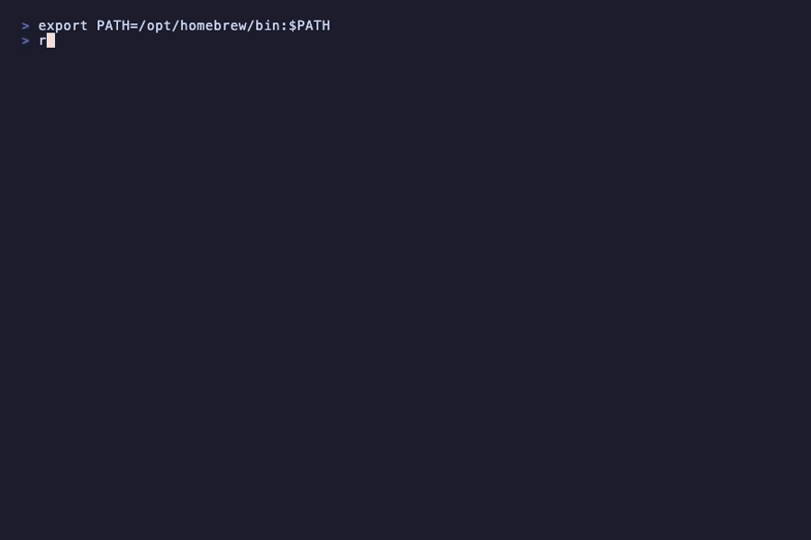

# ruah

**Multiple agents, one repo, no stepping on each other.**

When multiple AI agents work on the same repo, their edits collide. ruah gives each agent its own git worktree, checks the files it's touching, and merges everything back in dependency order.

```
  agent 1 ──→ worktree A ──→ src/auth/**  🔒
  agent 2 ──→ worktree B ──→ src/ui/**    🔒  ← conflicts blocked early
  agent 3 ──→ worktree C ──→ tests/**     🔒
```

Zero runtime dependencies. Works with Claude Code, Aider, Codex, Cursor, Windsurf, and any CLI.

## See It

```bash
npx @levi-tc/ruah demo
```

<p align="center">
  
</p>

Creates a temp repo, shows worktree isolation, file locking, conflict detection, and DAG scheduling — then cleans up. Takes 3 seconds.

## Use It

```bash
# Initialize in any git repo
npx @levi-tc/ruah init

# Create isolated tasks with file locks
ruah task create auth --files "src/auth/**" --executor claude-code --prompt "Add authentication"
ruah task create ui   --files "src/ui/**"   --executor aider       --prompt "Build dashboard"

# Both run in parallel — separate worktrees, isolated edit scopes
ruah task start auth
ruah task start ui

# Merge back (runs governance gates if available)
ruah task done auth && ruah task merge auth
ruah task done ui   && ruah task merge ui
```

Or define a full workflow as a DAG:

```bash
ruah workflow run .ruah/workflows/feature.md
```

## Why Not Just Branches?

Branches isolate history. They do not coordinate concurrent agent execution inside one repo.

- ruah gives each task its own worktree, so agents do not share a checkout
- ruah rejects overlapping lock scopes before agents start
- ruah can validate contract violations before merge instead of discovering them at the end

## Guarantees / Non-Guarantees

ruah currently guarantees:

- worktree isolation per task
- process-safe state writes with stale-write rejection
- lock conflict checks at task creation, resolved against repo files when available
- contract enforcement for read-only and shared-append workflow stages

ruah does not yet guarantee:

- semantic conflict freedom inside arbitrary overlapping code
- perfect prediction for brand-new files that do not exist when locks are taken
- automatic workflow recovery for every interrupted executor without operator input

## How It Works

### 1. Worktree Isolation

Each task gets its own git branch and worktree. Agents work in complete isolation — no interference, no stale reads, no merge surprises.

```
created → in-progress → done → merged
   │          │
   │          └→ failed
   └→ cancelled
```

### 2. File Locks

Lock scopes are checked at task creation. Overlapping patterns are rejected before any agent starts, using repo files when available:

```bash
ruah task create auth  --files "src/auth/**"   # ✓ locked
ruah task create login --files "src/auth/**"   # ✗ conflict with auth
ruah task create api   --files "src/api/**"    # ✓ no overlap
```

### 3. Workflow DAG

Markdown files define task graphs. Independent tasks run in parallel, dependent tasks wait.

```markdown
# Workflow: new-feature

## Config
- base: main
- parallel: true

## Tasks

### backend
- files: src/api/**
- executor: claude-code
- depends: []
- prompt: |
    Build the backend API endpoints.

### frontend
- files: src/ui/**
- executor: claude-code
- depends: []
- prompt: |
    Build the frontend components.

### tests
- files: tests/**
- executor: claude-code
- depends: [backend, frontend]
- prompt: |
    Write integration tests.
```

The DAG is validated (cycle detection, missing refs) before execution. When `parallel: true` is set, ruah's smart planner analyzes file overlaps and decides per-stage: full parallel, parallel with modification contracts, or serial. Contracted stages are validated after execution so read-only changes and non-append edits fail before merge.

### Recovery Example

When a workflow stops on a failed task:

```bash
ruah workflow explain .ruah/workflows/feature.md
ruah task takeover backend --executor codex
ruah workflow resume .ruah/workflows/feature.md
```

`workflow explain` shows the blocking task and the exact takeover and resume commands to run.

### 4. Subagent Spawning

Any running agent can spawn child tasks. Children branch from the parent — not from main — and merge back into the parent first.

```bash
# Inside a running agent:
ruah task create auth-api --parent auth --files "src/auth/api/**" --executor codex
ruah task create auth-ui  --parent auth --files "src/auth/ui/**"  --executor aider

# Children merge into parent, then parent merges into main
```

Parent merge is blocked until all children are merged or cancelled. Each agent receives `RUAH_TASK`, `RUAH_PARENT_TASK`, `RUAH_WORKTREE`, `RUAH_FILES`, and `RUAH_ROOT` as environment variables.

### 5. Executor Adapters

Built-in support for common AI agents.

| Executor | Agent |
|----------|-------|
| `claude-code` | Claude Code CLI |
| `aider` | Aider |
| `codex` | OpenAI Codex CLI |
| `open-code` | OpenCode |
| `script` | Any shell command |
| `raw` | Explicit shell execution via `sh -lc` / `cmd /c` |

### 6. Governance (crag)

Auto-detects `.claude/governance.md`. When found, gates run before every merge:

- **MANDATORY** — blocks merge on failure
- **OPTIONAL** — warns, continues
- **ADVISORY** — logs only

### 7. AI Agent Setup

Register ruah with all agents in one command:

```bash
ruah setup
```

Writes integration files for Claude Code, Cursor, Windsurf, Cody, and Continue. After setup, agents auto-detect ruah and know how to orchestrate tasks.

## CLI Reference

```
ruah init [--force]                        Initialize in a git repo
ruah setup [--force]                       Register with AI agents
ruah demo [--fast]                         Interactive demo

ruah task create <name> [options]          Create task with isolated worktree
  --files <globs>                            File patterns to lock
  --base <branch>                            Base branch
  --executor <cmd>                           Agent to run
  --prompt <text>                            Instructions for agent
  --parent <task>                            Create as subtask
  --depends <tasks>                          Upstream dependencies (comma-separated)
ruah task start <name> [--no-exec] [--dry-run] [--force]
ruah task done <name>
ruah task merge <name> [--dry-run] [--skip-gates]
ruah task list [--json]
ruah task claimable [--json]              List tasks ready to claim (deps satisfied)
ruah task children <name> [--json]
ruah task cancel <name>
ruah task retry <name> [--no-exec] [--dry-run]

ruah workflow run <file.md> [--dry-run] [--json]
ruah workflow resume <name|file>
ruah workflow explain <name|file>
ruah workflow plan <file.md> [--json]
ruah workflow list [--json]
ruah workflow create <name> [--force]

ruah status [--json]
ruah config
ruah doctor [--json]
ruah clean [--dry-run] [--force]
```

Every command supports `--json` for programmatic consumption.

## Install

```bash
npm install -g @levi-tc/ruah
```

Or use directly with `npx @levi-tc/ruah <command>`.

**Requirements:** Node.js 18+, Git. Zero runtime dependencies.

## Ecosystem

```
crag  — governance, discovery, skills, compilation    (@whitehatd/crag)
ruah  — multi-agent orchestration                     (@levi-tc/ruah)
arhy  — system contracts                              (@levi-tc/arhy)
```

## Community

- [Contributing](CONTRIBUTING.md)
- [Code of Conduct](CODE_OF_CONDUCT.md)
- [Security](SECURITY.md)
- [Changelog](CHANGELOG.md)

## License

MIT
